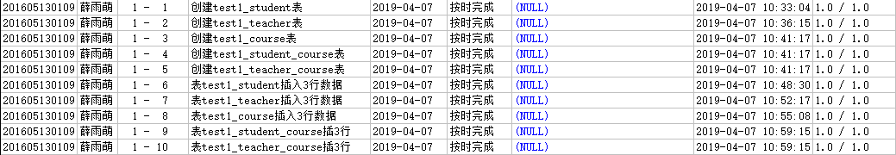

# 数据库系统课程实验报告

## 薛雨萌 201605130109

## 实验一 熟悉环境、建立/删除表、插入数据

### 1.创建学生信息表（学生编号、姓名、性别、年龄、出生日期、院系名称、班级）

~~~sql
create table test1_student
(
    sid char(12) not null,
    name varchar(10) not null,
    sex char(2),
    age int,
	birthday date,
    dname varchar(30),
    class varchar(10)
);
~~~

### 2.创建教师信息表(教师编号、姓名、性别、年龄、院系名称)

~~~sql
create table test1_teacher
(
    tid char(6) not null,
    name varchar(10) not null,
    sex char(2),
	age int,
    dname varchar(30)
);
~~~

### 3.创建课程信息表(仅考虑一门课程最多一个先行课的情况)（课程编号、课程名称、先行课编号、学分）

~~~sql
create table test1_course
(
    cid char(6) not null,
    name varchar(40) not null,
    fcid char(6),
	credit numeric(4,1)
);
~~~

### 4.创建学生选课信息表（学号、课程号、成绩、教师编号）

~~~sql
create table test1_student_course
(
    sid char(12) not null,
    cid char(6) not null,
	score numeric(5,1),
	tid char(6)
);
~~~

### 5.创建教师授课信息表（教师编号、课程编号）

~~~sql
create table test1_teacher_course
(
    tid char(6) not null,
    cid char(6) not null
);
~~~

### 6.给表test1_student插入如下3行数据

|     学号     | 姓名 | 性别 | 年龄 | 出生日期 |  院系名称  | 班级 |
| :----------: | :--: | :--: | :--: | :------: | :--------: | :--: |
| 200800020101 | 王欣 |  女  |  19  | 1994-2-2 | 计算机学院 | 2010 |
| 200800020102 | 李华 |  女  |  20  | 1995-3-3 |  软件学院  | 2009 |
| 200800020103 | 赵岩 |  男  |  21  | 1996-4-4 |  软件学院  | 2009 |

~~~sql
insert into test1_student values('200800020101','王欣','女',19,date'1994-2-2','计算机学院','2010');
insert into test1_student values('200800020102','李华','女',20,date'1995-3-3','软件学院','2009');
insert into test1_student values('200800020103','赵岩','男',21,date'1996-4-4','软件学院','2009');
~~~

### 7.给表test1_teacher插入3行数据

| 教师编号 | 教师姓名 | 性别 | 年龄 |  院系名称  |
| :------: | :------: | :--: | :--: | :--------: |
|  100101  |  张老师  |  男  |  44  | 计算机学院 |
|  100102  |  李老师  |  女  |  45  |  软件学院  |
|  100103  |  马老师  |  男  |  46  | 计算机学院 |

~~~sql
insert into test1_teacher values('100101','张老师','男',44,'计算机学院');
insert into test1_teacher values('100102','李老师','女',45,'软件学院');
insert into test1_teacher values('100103','马老师','男',46,'计算机学院');
~~~

### 8.给表test1_course插入如下3行数据

| 课程号 |  课程名  | 先行课程号 | 学分 |
| :----: | :------: | :--------: | :--: |
| 300001 | 数据结构 |            |  2   |
| 300002 |  数据库  |   300001   | 2.5  |
| 300003 | 操作系统 |   300001   |  4   |

~~~sql
insert into test1_course values('300001','数据结构',NULL,2);
insert into test1_course values('300002','数据库','300001',2.5);
insert into test1_course values('300003','操作系统','300001',4);
~~~

### 9.给表test1_student_course插入3行数据

|     学号     | 课程号 | 成绩 | 教师编号 |
| :----------: | :----: | :--: | :------: |
| 200800020101 | 300001 | 91.5 |  100101  |
| 200800020101 | 300002 | 92.6 |  100102  |
| 200800020101 | 300003 | 93.7 |  100103  |

~~~sql
insert into test1_student_course values('200800020101','300001',91.5,'100101');
insert into test1_student_course values('200800020101','300002',92.6,'100102');
insert into test1_student_course values('200800020101','300003',93.7,'100103');
~~~

### 10.给表test1_teacher_course插入如下3行数据

| 教师编号 | 课程号 |
| :------: | :----: |
|  100101  | 300001 |
|  100102  | 300002 |
|  100103  | 300003 |

```sql
insert into test1_teacher_course values('100101','300001');
insert into test1_teacher_course values('100102','300002');
insert into test1_teacher_course values('100103','300003');
```

### 实验结果



### 实验总结

通过本次实验，掌握了基本的实验系统使用方法，以及基本的建表插入操作。