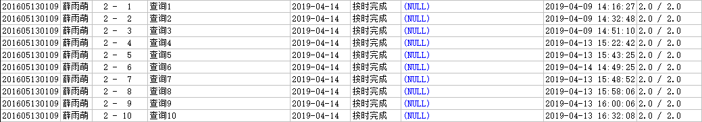

# 数据库系统课程实验报告

## 薛雨萌 201605130109

## 实验二 检索查询

### 1.找出没有选修任何课程的学生的学号、姓名(即没有选课记录的学生）

~~~sql
create table test2_01 as select sid,name from pub.STUDENT
where sid not in (select sid from pub.STUDENT_COURSE);
~~~

### 2.找出至少选修了学号为“200900130417”的学生所选修的一门课的学生的学号、姓名

~~~sql
create table test2_02 as select sid,name from pub.STUDENT
where sid in (select sid from pub.STUDENT_COURSE
              where cid in (select cid from pub.STUDENT_COURSE
                            where sid='200900130417'
                           )
             );
~~~

### 3.找出至少选修了一门其先行课程号为“300002”号课程的学生的学号、姓名

~~~sql
create table test2_03 as select sid,name from pub.STUDENT
where sid in (select sid from pub.STUDENT_COURSE natural join pub.COURSE
              where fcid='300002'
             );
~~~

### 4.找出选修了“操作系统”并且也选修了“数据结构”的学生的学号、姓名

~~~sql
create table test2_04 as select sid,name from pub.STUDENT natural join pub.STUDENT_COURSE
where cid=(select cid from pub.COURSE where name='操作系统') 
and sid in (select sid from pub.STUDENT_COURSE
              where cid=(select cid from pub.COURSE where name='数据结构') 
             );
~~~

### 5.查询20岁的所有有选课的学生的学号、姓名、平均成绩(avg_score，此为列名，下同)（平均成绩四舍五入到个位）、总成绩(sum_score)

~~~sql
create table test2_05 as select sid,name,round(avg(score),0) avg_score,sum(score) sum_score from pub.STUDENT natural join pub.STUDENT_COURSE
where age='20'
group by sid,name;
~~~

### 6.查询所有课的最高成绩、次高成绩（次高成绩一定小于最高成绩）、最高成绩人数，test2_06有四个列：课程号cid、课程名称name、最高成绩max_score、次高成绩max_score2、最高成绩人数max_score_count（一个学生同一门课成绩都是第一，只计一次）。如果没有学生选课，则最高成绩为空值,最高成绩人数为零。如果没有次高成绩，则次高成绩为空值

~~~sql
create table test2_06 as
with
maxscore(max_score,cid) as
(
	select max(score),cid from pub.STUDENT_COURSE
	group by cid
),
maxscore2(max_score2,cid) as
(
	select max(a.score),a.cid from pub.STUDENT_COURSE a
	where a.score < (select max(score) from pub.STUDENT_COURSE where cid=a.cid)
	group by cid
),
maxscorecount(max_score_count,cid) as
(	
	select count(distinct a.sid),a.cid from pub.STUDENT_COURSE a
	where a.score=(select max(score) from pub.STUDENT_COURSE where cid=a.cid)
	group by cid
)
select distinct cid,name,max_score,max_score2,max_score_count
from pub.COURSE natural left outer join maxscore natural left outer join maxscore2 natural left outer join maxscorecount;
~~~

### 7.查询所有不姓张、不姓李、也不姓王的学生的学号sid、姓名name

~~~sql
create table test2_07 as select sid,name from pub.STUDENT
where name not like '张%' and name not like '王%' and name not like '李%';
~~~

### 8.查询学生表中每一个姓氏及其人数（不考虑复姓），test2_08有两个列：second_name、p_count

~~~sql
create table test2_08 as select substr(name,1,1) second_name,count(*) p_count from pub.STUDENT
group by substr(name,1,1);
~~~

### 9.查询选修了300003号课程的学生的sid、name、score

~~~sql
create table test2_09 as select sid,name,score from pub.STUDENT natural join pub.STUDENT_COURSE
where cid='300003';
~~~

### 10.找出同一个同学同一门课程有两次或以上不及格的所有学生的学号、姓名（即一门课程需要补考两次或以上的学生的学号、姓名）

```sql
create table test2_10 as select distinct sid,name from (pub.STUDENT natural join pub.STUDENT_COURSE)
group by cid,sid,name
having sum(case when score<60 then 1 else 0 end)>=2
```

### 实验结果



### 实验总结

通过本次实验，掌握了基本的检索查询操作，加深了对子查询作用的体会。