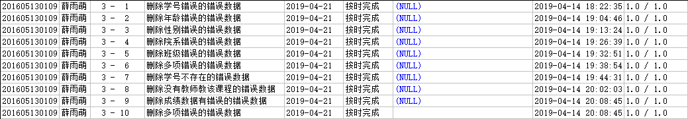

# 数据库系统课程实验报告

## 薛雨萌 201605130109

## 实验三 复制表、删除数据

### 1.将pub用户下的Student_31及数据复制到主用户的表test3_01，删除表中的学号不全是数字的那些错误数据，学号应该是数字组成，不能够包含字母空格等非数字字符

~~~sql
create table test3_01 as (select * from pub.STUDENT_31
                          where regexp_like(sid,'^[[:digit:]]{12}$')
                          );
~~~

### 2.将pub用户下的Student_31及数据复制到主用户的表test3_02，删除表中的出生日期和年龄(截止到2012年的年龄，即年龄=2012-出生年份)不一致的那些错误数据

~~~sql
create table test3_02 as (select * from pub.STUDENT_31);
delete from test3_02
where age!=2012 - extract(year from birthday);
~~~

### 3.将pub用户下的Student_31及数据复制到主用户的表test3_03，删除表中的性别有错误的那些错误数据（性别只能够是“男”、“女”或者空值）

~~~sql
create table test3_03 as (select * from pub.STUDENT_31);
delete from test3_03
where sex!='男' and sex!='女' and sex is not NULL;
~~~

### 4.将pub用户下的Student_31及数据复制到主用户的表test3_04，删除表中的院系名称有空格的、院系名称为空值的或者院系名称小于3个字的那些错误数据

~~~sql
create table test3_04 as (select * from pub.STUDENT_31);
delete from test3_04
where dname like '% %' or dname is NULL or length(dname)<3;
~~~

### 5.将pub用户下的Student_31及数据复制到主用户的表test3_05，删除表中的班级不规范的那些错误数据，不规范是指和大多数不一致

~~~sql
create table test3_05 as (select * from pub.STUDENT_31);
delete from test3_05
where not regexp_like(class,'^[[:digit:]]{4}$');
~~~

### 6.将pub用户下的Student_31及数据复制到主用户的表test3_06，删除表中的错误数据，不规范的数据也被认为是那些错误数据

* 学号不全是数字；
* 出生日期和年龄不一致的(年龄=2012-出生年份)；
* 姓名有空格的或者长度小于2个字的；函数length()返回字符串长度。
* 性别有错误的（只能够是“男”、“女”、空值）；
* 院系名称有空格的、院系名称为空值的；
* 院系名称小于3个字的；
* 班级数据有错误的（需要先找到班级里面的错误）。

~~~sql
create table test3_06 as (select * from pub.STUDENT_31);
delete from test3_06
where not regexp_like(sid,'^[[:digit:]]{12}$') or
age!=2012 - extract(year from birthday) or
name like '% %' or length(name)<2 or
(sex!='男' and sex!='女' and sex is not NULL) or
dname like '% %' or dname is NULL or length(dname)<3 or
not regexp_like(class,'^[[:digit:]]{4}$');
~~~

### 7.将pub用户下的Student_course_32及数据复制到主用户的表test3_07，删除其中的错误数据，错误指如下情况：学号在学生信息pub.student中不存在的

~~~sql
create table test3_07 as (select * from pub.STUDENT_COURSE_32);
delete from test3_07
where sid not in (select sid from pub.STUDENT);
~~~

### 8.将pub用户下的Student_course_32及数据复制到主用户的表test3_08，删除其中的错误数据，错误指如下情况：课程号和教师编号在教师授课表pub.teacher_course中不同时存在的，即没有该教师教该课程

~~~sql
create table test3_08 as (select * from pub.STUDENT_COURSE_32);
delete from test3_08
where tid not in (select tid from pub.TEACHER_COURSE where cid=test3_08.cid);
~~~

### 9.将pub用户下的Student_course_32及数据复制到主用户的表test3_09，删除其中的错误数据，错误指如下情况：成绩数据有错误（需要先找到成绩里面的错误）

~~~sql
create table test3_09 as (select * from pub.STUDENT_COURSE_32);
delete from test3_09
where score<0 or score>100;
~~~

### 10.将pub用户下的Student_course_32及数据复制到主用户的表test3_10，删除其中的错误数据

1． 错误指如下情况：

* 学号在学生信息pub.student中不存在的；
* 课程号在课程信息pub.course中不存在的；
* 教师编号在教师信息pub.teacher中不存在的；
* 课程号和教师编号在教师授课表pub.teacher_course中不存在的；
* 成绩数据有错误（需要先找到成绩里面的错误）。

保留最后正确的数据。

~~~sql
create table test3_10 as (select * from pub.STUDENT_COURSE_32);
delete from test3_10
where sid not in (select sid from pub.STUDENT) or
cid not in (select cid from pub.COURSE) or
tid not in (select tid from pub.TEACHER) or
tid not in (select tid from pub.TEACHER_COURSE where cid=test3_10.cid) or
score<0 or score>100;
~~~

### 实验结果

### 实验总结

通过本次实验，掌握表的复制与删除的方法，还掌握了正则表达式的书写。