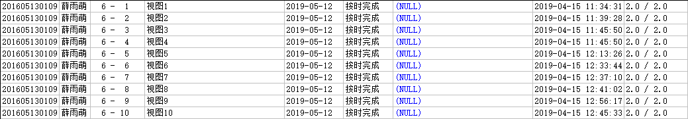

# 数据库系统课程实验报告

## 薛雨萌 201605130109

## 实验六 创建视图、删除视图

### 1.找出年龄小于20岁且是“物理学院”的学生的学号、姓名、院系名称,按学号排序

~~~sql
create view test6_01 as select sid,name,dname from pub.STUDENT
where age<20 and dname='物理学院'
order by sid;
~~~

### 2.查询统计2009级、软件学院每个学生的学号、姓名、总成绩（列名sum_score）

~~~sql
create view test6_02 as select sid,name,sum(score) sum_score from pub.STUDENT natural join pub.STUDENT_COURSE
where class='2009' and dname='软件学院'
group by sid,name;
~~~

### 3.查询2010级、计算机科学与技术学院、操作系统的学生成绩表，内容有学号、姓名、成绩

~~~sql
create view test6_03 as select sid,name,score from pub.STUDENT natural join pub.STUDENT_COURSE
where class='2010' and dname='计算机科学与技术学院' and cid=(select cid from pub.COURSE where name='操作系统');
~~~

### 4.找出选修“数据库系统”课程，且成绩大于90的学生的学号、姓名

~~~sql
create view test6_04 as select sid,name from pub.STUDENT natural join pub.STUDENT_COURSE
where cid=(select cid from pub.COURSE where name='数据库系统') and score>90;
~~~

### 5.找出姓名叫“李龙”的学生的学号及其选修全部课程的课程号、课程名和成绩

~~~sql
create view test6_05 as select pub.STUDENT.SID sid,pub.STUDENT_COURSE.CID cid,pub.COURSE.NAME name,pub.STUDENT_COURSE.SCORE score from pub.STUDENT,pub.STUDENT_COURSE,pub.COURSE
where pub.STUDENT.NAME='李龙' and pub.STUDENT.SID=pub.STUDENT_COURSE.SID and pub.STUDENT_COURSE.CID=pub.COURSE.CID;
~~~

### 6.找出选修了所有课程的学生的学号、姓名

~~~sql
create view test6_06 as select sid,name from pub.STUDENT
where not exists((select cid from pub.COURSE) minus
       (select cid from pub.STUDENT_COURSE where sid=pub.STUDENT.sid));
~~~

### 7.找出选修了所有课程并且所有课程全部通过的学生的学号、姓名

~~~sql
create view test6_07 as select sid,name from pub.STUDENT
where not exists((select cid from pub.COURSE) minus
       (select cid from pub.STUDENT_COURSE where sid=pub.STUDENT.sid))
      and not exists(select cid from pub.STUDENT_COURSE where sid=pub.STUDENT.sid and score<60);
~~~

### 8.检索先行课的学分为2的课程号、课程名

~~~sql
create view test6_08 as select a.cid,a.name from pub.COURSE a
where (select credit from pub.COURSE b where a.fcid=b.cid)=2;
~~~

### 9.查询统计2010级、化学与化工学院的学生总学分表，内容有学号、姓名、总学分sum_credit

~~~sql
create view test6_09 as select a.sid,a.name,sum(c.credit) sum_credit from pub.STUDENT a,pub.STUDENT_COURSE b,pub.COURSE c
where a.sid=b.sid and b.cid=c.cid and a.class='2010' and a.dname='化学与化工学院' and b.score>=60
group by a.sid,a.name;
~~~

### 10.找出有间接先行课的所有课程的课程号、课程名称

~~~sql
create view test6_10 as select a.cid,a.name from pub.COURSE a
where exists(select b.cid from pub.COURSE b where a.fcid=b.cid and b.scid is not NULL);
~~~

### 实验结果

### 实验总结

通过本次实验，掌握了基本的视图创建与删除，加深了对视图的理解。