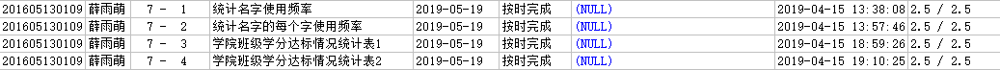

# 数据库系统课程实验报告

## 薛雨萌 201605130109

## 实验七 综合查询

### 1.在学生表pub.student中统计名字（姓名的第一位是姓氏，其余为名字，不考虑复姓）的使用的频率，将统计结果放入test7_01中，表结构如下

| first_name varchar(4) | frequency  numeric(4) |
| --------------------- | --------------------- |
| 国强                  | 1034                  |
| 红                    | 1232                  |
| 卫东                  | 2323                  |
| ………………                |                       |

~~~sql
create table test7_01
(
	first_name varchar(4),
    frequency numeric(4)
);
insert into test7_01 select substr(name,2),count(*) from pub.STUDENT
group by substr(name,2);
~~~

### 2.在学生表pub.student中统计名字（姓名的第一位是姓氏，不作统计，名字指姓名的第二个之后的汉字）的每个字使用的频率，将统计结果放入test7_02中（特别提示：需要区别union和union all的不同），表结构如下

| letter varchar(2) | frequency  numeric(4) |
| ----------------- | --------------------- |
| 锋                | 1034                  |
| 红                | 1232                  |
| 鹏                | 2323                  |
| ………………            |                       |

~~~sql
create table test7_02
(
	letter varchar(2),
    frequency numeric(4)
);
insert into test7_02 select a.letter,count(*) from ((select sbustr(name,2,1) letter from pub.STUDENT) union all (select sbustr(name,3,1) letter from pub.STUDENT where sbustr(name,3,1) is not NULL)) a
group by a.letter;
~~~

### 3.创建“学院班级学分达标情况统计表1”test7_03，依据pub.student， pub.course，pub.student_course统计形成表中各项数据，成绩>=60为及格计入学分，总学分>=10为达标，院系为空值的数据不统计在下表中，表结构：院系名称dname、班级class、学分达标人数p_count1、学分未达标人数p_count2、总人数p_count

| dname varchar(30) | class varchar(10) | p_count1 int | p_count2 int | p_count int |
| :---------------: | :---------------: | :----------: | :----------: | :---------: |
|    计算机学院     |       2006        |              |              |             |
|    计算机学院     |       2007        |              |              |             |
|     软件学院      |       2006        |              |              |             |
|      ………………       |                   |              |              |             |

这里比较坑的地方在于有的同学可能一门及格的课程都没有。

~~~sql
create table test7_03
(
	dname varchar(30),
    class varchar(10),
    p_count1 int,
    p_count2 int,
    p_count int
);
insert into test7_03
with
credit_student(sid,credit_sum) as
(
    select sid,sum(credit) from (select distinct sid,cid from pub.STUDENT_COURSE 
                                 where score>=60) natural join pub.COURSE
    group by sid
),
count1(dname,class,p_count1) as
(
    select a.dname,a.class,count(distinct a.sid) from pub.STUDENT a
    where a.dname is not NULL and (select credit_sum from credit_student where a.sid=sid)>=10
    group by a.dname,a.class
),
count2(dname,class,p_count2) as
(
	select a.dname,a.class,count(distinct a.sid) from pub.STUDENT a
    where a.dname is not NULL and （(select credit_sum from credit_student where a.sid=sid)<10 or (select credit_sum from credit_student where a.sid=sid) is NULL）
    group by a.dname,a.class
),
counta(dname,class,p_count) as
(
	select a.dname,a.class,count(distinct a.sid) from pub.STUDENT a
    where a.dname is not NULL
    group by a.dname,a.class
)
select dname,class,p_count1,p_count2,p_count from count1 natural full outer join count2 natural full outer join counta;
update test7_03 set p_count1=0 where p_count1 is NULL;
update test7_03 set p_count2=0 where p_count2 is NULL;
~~~

### 4.创建“学院班级学分达标情况统计表2”test7_04，依据pub.student， pub.course，pub.student_course统计形成表中各项数据，成绩>=60为及格计入学分，2008级及之前的班级总学分>=8为达标，2008级之后的班级学分>=10未达标，院系为空值的数据不统计在下表中，表结构：院系名称dname、班级class、学分达标人数p_count1、学分未达标人数p_count2、总人数p_count

| dname varchar(30) | class varchar(10) | p_count1 int | p_count2 int | p_count int |
| :---------------: | :---------------: | :----------: | :----------: | :---------: |
|    计算机学院     |       2006        |              |              |             |
|    计算机学院     |       2007        |              |              |             |
|     软件学院      |       2006        |              |              |             |
|      ………………       |                   |              |              |             |

~~~sql
create table test7_04
(
	dname varchar(30),
    class varchar(10),
    p_count1 int,
    p_count2 int,
    p_count int
);
insert into test7_04
with
credit_student(sid,credit_sum) as
(
    select sid,sum(credit) from (select distinct sid,cid from pub.STUDENT_COURSE 
                                 where score>=60) natural join pub.COURSE
    group by sid
),
count1(dname,class,p_count1) as
(
    select a.dname,a.class,count(distinct a.sid) from pub.STUDENT a
    where a.dname is not NULL and ((a.class>'2008' and (select credit_sum from credit_student where a.sid=sid)>=10) or (a.class<='2008' and (select credit_sum from credit_student where a.sid=sid)>=8))
    group by a.dname,a.class
),
count2(dname,class,p_count2) as
(
	select a.dname,a.class,count(distinct a.sid) from pub.STUDENT a
    where a.dname is not NULL and （(a.class>'2008' and (select credit_sum from credit_student where a.sid=sid)<10) or (a.class<='2008' and (select credit_sum from credit_student where a.sid=sid)<8) or (select credit_sum from credit_student where a.sid=sid) is NULL）
    group by a.dname,a.class
),
counta(dname,class,p_count) as
(
	select a.dname,a.class,count(distinct a.sid) from pub.STUDENT a
    where a.dname is not NULL
    group by a.dname,a.class
)
select dname,class,p_count1,p_count2,p_count from count1 natural full outer join count2 natural full outer join counta;
update test7_04 set p_count1=0 where p_count1 is NULL;
update test7_04 set p_count2=0 where p_count2 is NULL;
~~~

### 实验结果

### 实验总结

通过本次实验，更深入地掌握了sql的综合运用。