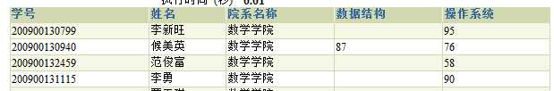

# 数据库系统课程实验报告

## 薛雨萌 201605130109

## 实验八 报表统计

### 1.查询各院系（不包括院系名称为空的）的数据结构平均成绩avg_ds_score、操作系统平均成绩avg_os_score，平均成绩四舍五入到个位，创建表test8_01，表结构及格式如下

|     dname      | avg_ds_score | avg_os_score |
| :------------: | :----------: | :----------: |
| 马克思主义学院 |      72      |      70      |
|    软件学院    |      77      |      74      |
|    艺术学院    |      77      |      76      |
|     医学院     |      74      |      73      |

~~~sql
create table test8_01(dname,avg_ds_score,avg_os_score) as
with
ds(dname,avg_ds_score) as
(
    select a.dname,round(avg(b.score),0) from pub.STUDENT a,pub.STUDENT_COURSE b
	where a.dname is not NULL and a.sid=b.sid and b.cid=(select cid from pub.COURSE where name='数据结构') and b.score=(select max(score) from pub.STUDENT_COURSE where sid=a.sid and cid=(select cid from pub.COURSE where name='数据结构'))
	group by a.dname
),
os(dname,avg_os_score) as
(
    select a.dname,round(avg(b.score),0) from pub.STUDENT a,pub.STUDENT_COURSE b
	where a.dname is not NULL and a.sid=b.sid and b.cid=(select cid from pub.COURSE where name='操作系统') and b.score=(select max(score) from pub.STUDENT_COURSE where sid=a.sid and cid=(select cid from pub.COURSE where name='操作系统'))
	group by a.dname
)
select dname,avg_ds_score,avg_os_score from ds natural full outer join os;
~~~

### 2.查询”计算机科学与技术学院”的同时选修了数据结构、操作系统两门课的学生的学号sid、姓名name、院系名称dname、数据结构成绩ds_score、操作系统成绩os_score，创建表test8_02，表结构及格式如下

~~~sql
create table test8_02(sid,name,dname,ds_score,os_score) as
select a.sid,a.name,a.dname,max(b.score),max(c.score) from pub.STUDENT a,pub.STUDENT_COURSE b,pub.STUDENT_COURSE c
where a.dname='计算机科学与技术学院' and a.sid=b.sid and a.sid=c.sid and b.cid=(select cid from pub.COURSE where name='数据结构') and c.cid=(select cid from pub.COURSE where name='操作系统')
group by a.sid,a.name,a.dname;
~~~

### 3.查询计算机科学与技术学院的选修了数据结构或者操作系统的学生的学号sid、姓名name、院系名称dname、数据结构成绩ds_score、操作系统成绩os_score，创建表test8_03，表结构及格式如下

~~~sql
create table test8_03(sid,name,dname,ds_score,os_score) as
with
ds(sid,name,dname,ds_score) as
(
    select a.sid,a.name,a.dname,max(b.score) from pub.STUDENT a,pub.STUDENT_COURSE b
	where a.dname='计算机科学与技术学院' and a.sid=b.sid and b.cid=(select cid from pub.COURSE where name='数据结构')
	group by a.sid,a.name,a.dname
),
os(sid,name,dname,os_score) as
(
    select a.sid,a.name,a.dname,max(b.score) from pub.STUDENT a,pub.STUDENT_COURSE b
	where a.dname='计算机科学与技术学院' and a.sid=b.sid and b.cid=(select cid from pub.COURSE where name='操作系统')
	group by a.sid,a.name,a.dname
)
select sid,name,dname,ds_score,os_score from ds natural full outer join os;
~~~

### 4.查询计算机科学与技术学院所有学生的学号sid、姓名name、院系名称dname、数据结构成绩ds_score、操作系统成绩os_score，创建表test8_04，表结构及格式如下

~~~sql
create table test8_04(sid,name,dname,ds_score,os_score) as
with
ds(sid,name,dname,ds_score) as
(
    select a.sid,a.name,a.dname,max(b.score) from pub.STUDENT a,pub.STUDENT_COURSE b
	where a.dname='计算机科学与技术学院' and a.sid=b.sid and b.cid=(select cid from pub.COURSE where name='数据结构')
	group by a.sid,a.name,a.dname
),
os(sid,name,dname,os_score) as
(
    select a.sid,a.name,a.dname,max(b.score) from pub.STUDENT a,pub.STUDENT_COURSE b
	where a.dname='计算机科学与技术学院' and a.sid=b.sid and b.cid=(select cid from pub.COURSE where name='操作系统')
	group by a.sid,a.name,a.dname
),
all_stu(sid,name,dname) as
(
	select distinct sid,name,dname from pub.STUDENT
	where dname='计算机科学与技术学院'
)
select sid,name,dname,ds_score,os_score from ds natural full outer join os natural full outer join all_stu;
~~~

### 实验结果

### 实验总结

通过本次实验，掌握了sql在报表统计方面的应用。